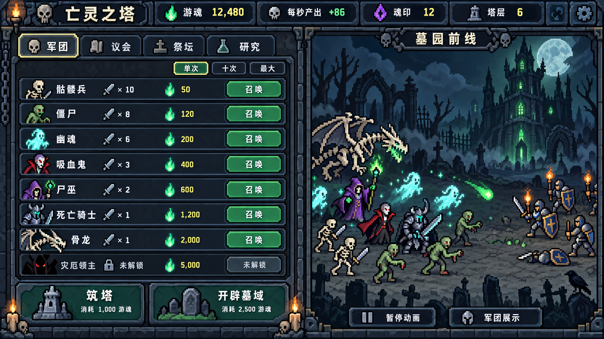

# 暗黑像素界面参考图

日期：2026-09-17。使用内置 imagegen 生成，用于美术开发讨论；未修改游戏源码。



## 采用的方向

- 左侧经营操作：军团列表、系统标签、购买数量和重置动作；右侧是连续的墓园战场。
- 用户提供的种植游戏图片仅作为像素表现参考：清晰色块、阶梯状硬边、厚实面板、可辨认的小图标。题材改为墓园、高塔与亡灵军团。
- 大面积使用暗石板、旧铁和冷灰；魂火绿、幽魂青、斗篷暗红与尸巫紫负责局部辨识。暗部仍需保留层次。
- 战场包含不同亡灵种族和少量敌方守卫，通过阵型、施法、挥击表现军团。生产收入仍由增量系统结算。

## 制作时的取舍

此图用于确认布局与气氛，不是可直接切图上线的素材图集。正式素材应统一像素网格，简化背景碎纹，减少角色颜色，并将文字、按钮和图标分别制作。图中接近等宽的双栏可作为初始样张，实际排版优先保证经营列表的长数值和按钮空间，必要时调整到约 60:40。

图中文字、数量、价格、塔层和解锁状态都是示意占位，尤其底部“筑塔”“开辟墓域”的游魂费用不代表实际机制。实际条件、收益与解锁顺序以[玩法迁移设计](../亡灵之塔-增量玩法迁移设计.md)及[逐项内容映射表](../亡灵之塔-逐项内容映射表.md)为准。图中战斗没有额外定义伤害、击杀收益或单位损耗。

## 最终生成提示词

生成方式：内置 imagegen。输入：用户提供的像素种植游戏截图，作为风格参考。

```text
Use case: ui-mockup. Create one landscape 16:9 desktop GAME SCREEN concept image for the Chinese dark fantasy incremental game “亡灵之塔”, as a practical art-development reference. Input image is STYLE REFERENCE ONLY: match its clearly visible chunky pixel grid, hard black stepped outlines, compact game sprites, limited-color hand-placed clusters, raised framed pixel panels, legible Chinese labels. Do NOT reuse the gardening subject, pots, wooden tabletop, bright blue panels or three-column layout.
MANDATORY COMPOSITION: TWO COLUMNS, MANAGEMENT ON THE LEFT (about 60% width), BATTLEFIELD ON THE RIGHT (about 40% width). Full-width compact top resource bar. No browser frame, no explanatory arrows, no marketing hero.
LEFT: dense but readable dark iron and weathered stone management interface. Header “亡灵之塔”. Tabs “军团”, “议会”, “祭坛”, “研究”. Purchase selector “单次  十次  最大”. Eight clean horizontal troop rows with distinct colorful pixel portraits, Chinese name, simple illustrative quantity/cost, rectangular green-gray “召唤” buttons. Row names exactly: “骷髅兵”, “僵尸”, “幽魂”, “吸血鬼”, “尸巫”, “死亡骑士”, “骨龙”, “灾厄领主”. Last row may be visibly locked with “未解锁”. Bottom action area “筑塔” and “开辟墓域”, separated from normal purchases. Top resource bar labels “游魂”, “每秒产出”, “魂印”, “塔层”, use a few clear sample values such as 12,480, +86, 12, 6. These are mock data.
RIGHT: a single coherent chunky PIXEL ART graveyard battlefield, not a grid of cards. Label “墓园前线”. Upper background contains a crooked gothic necromancer tower, green-lit windows, a faint cold moon, dead trees, ruined archway, low fog made of solid pixel clusters. Lower two-thirds shows a small visible undead army in combat: ivory skeleton swordsmen, hunched green zombies, floating pale-cyan ghosts, red-cloaked vampire, purple-robed lich raising a green staff, heavily armored death knight, a larger bone dragon behind them. The friendly squad pushes from the left side of this right-hand scene toward a few torch-bearing armored human sentinels at its far right. Show one readable green projectile, a sword strike, several sparse soul particles, fallen shields; no gore. Recognizable simple sprites around 16x24 or 24x24 source pixels enlarged uniformly, dragon around48x32. Battlefield must have breathing room between units, not a noisy miniature painting. Footer under scene “暂停动画” and “军团展示”.
MOOD/PALETTE: materially darker than the reference but easily readable; desaturated charcoal green-black backgrounds, cold blue-gray stone, tarnished bronze edges, ivory text, restrained phosphor-green magic, muted crimson vampire cloth, subtle violet lich robe. Several value levels, don't crush everything to black. Thick simple pixel borders as in the reference, restrained gothic ornament, no ornate realistic gold filigree.
STRICT STYLE: actual deliberately low-resolution 2D pixel graphics with consistently enlarged square pixels, simple shapes, limited shading about 4-6 colors per character, crisp nearest-neighbor look. It must look like a modest-scope playable pixel game, NOT high-detail painted concept art with pixel noise added, NOT realistic illustration, NOT 3D, NOT vector, NOT blurry, NOT smoothly anti-aliased, NOT cute cheerful farming. Chinese text can have greater readability resolution while sprites remain coarse. Show the entire screen uncropped.
```
